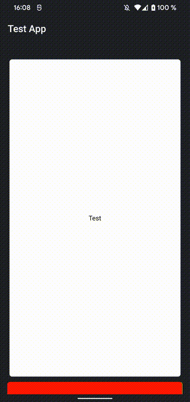

```xml
<ScrollableView id="sv" cacheSize="10" module="ti.pagetransform">
   <View borderRadius="6" onTouchstart="touchStart" onTouchend="touchEnd" onTouchmove="touchMove" backgroundColor="#fff"><Label text="Test" color="#000"/></View>
   <View borderRadius="6" onTouchstart="touchStart" onTouchend="touchEnd" onTouchmove="touchMove" backgroundColor="#f00"><Label text="Test"/></View>
   <View borderRadius="6" onTouchstart="touchStart" onTouchend="touchEnd" onTouchmove="touchMove" backgroundColor="#0f0"><Label text="Test" color="#000"/></View>
   <View borderRadius="6" onTouchstart="touchStart" onTouchend="touchEnd" onTouchmove="touchMove" backgroundColor="#00f"><Label text="Test"/></View>
   <View borderRadius="6" onTouchstart="touchStart" onTouchend="touchEnd" onTouchmove="touchMove" backgroundColor="#ff0"><Label text="Test" color="#000"/></View>
</ScrollableView>
```

```js
var pt = require("ti.pagetransform");
var tX = 0;


function onOpen(e) {
	pt.createStack({
		scrollableView: $.sv
	});
}

function touchMove(e){
	e.source.translationX = tX  - e.x;
}
function touchEnd(e){
	e.source.translationX = 0;
}

function touchStart(e){
	tX = e.x;
}
$.index.open();
```
